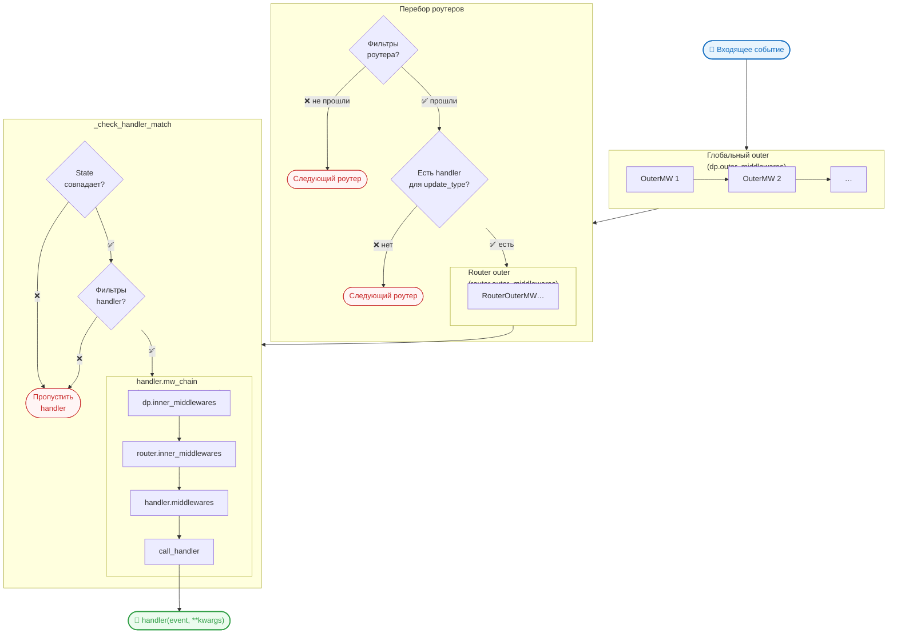

# Middleware

Middleware позволяет обрабатывать события до и после обработчиков.

## Создание middleware

```python
from maxapi.filters.middleware import BaseMiddleware
from typing import Any, Awaitable, Callable, Dict

class LoggingMiddleware(BaseMiddleware):
    async def __call__(
        self,
        handler: Callable[[Any, Dict[str, Any]], Awaitable[Any]],
        event_object: Any,
        data: Dict[str, Any],
    ) -> Any:
        print(f"Обработка события: {event_object.update_type}")
        result = await handler(event_object, data)
        print(f"Обработка завершена")
        return result
```

## Outer и inner: когда что вызывается

У `Dispatcher` (и `Router`) есть две явные категории middleware:

- **`register_outer_middleware(mw)`** — вызывается до проверки фильтров
  и state конкретного handler. Срабатывает на **каждое** подходящее
  событие, даже если handler в итоге будет пропущен. Подходит для
  логирования, трейсинга, request-id и т.п.
- **`register_inner_middleware(mw)`** — вызывается **только** когда
  конкретный handler прошёл все свои фильтры/state и будет реально
  исполнен. Подходит для транзакций БД, метрик времени handler,
  захвата распределённых блокировок и т.п.

```python
dp.register_outer_middleware(LoggingMiddleware())        # каждый update
dp.register_inner_middleware(DbTransactionMiddleware())  # только под handler
```

То же доступно на `Router`:

```python
router.register_outer_middleware(AuditMiddleware())
router.register_inner_middleware(LockMiddleware())
```

## Схема потока вызовов



!!! info "Ключевое свойство inner middleware"
    Всё то, что зарегистрировано через `register_inner_middleware()`,
    **выпекается** в `handler.mw_chain` один раз при
    `startup()` / `start_polling()`. В горячем пути — ноль лишних
    аллокаций.

!!! warning "Deprecated"
    Безымянные `dp.middleware(mw)` / `router.middleware(mw)` и
    `dp.outer_middleware(mw)` / `router.outer_middleware(mw)`
    помечены как deprecated и выводят `DeprecationWarning`.
    Используйте явные `register_outer_middleware()` /
    `register_inner_middleware()`.

## Развёрнутый пример: admin-роутер с broadcast

Рассмотрим реальный сценарий: у бота есть два роутера — `admin_router`
для команды `/broadcast` и `fallback_router` для всех остальных
сообщений. Нам нужно:

- фиксировать **любую** попытку войти в admin-flow — в том числе
  неудачную (не-админ написал `/broadcast`);
- захватывать дорогой distributed lock **только** когда broadcast
  реально стартует.

```python
import asyncio
from maxapi import Bot, Dispatcher, Router
from maxapi.filters import F
from maxapi.filters.command import Command
from maxapi.filters.filter import BaseFilter
from maxapi.filters.middleware import BaseMiddleware
from maxapi.types.updates.message_created import MessageCreated


# ── Фильтры ──────────────────────────────────────────────────────────────────

class IsAdmin(BaseFilter):
    """Пропускает только пользователей из списка администраторов."""

    ADMIN_IDS = {111222333}

    async def __call__(self, event: MessageCreated) -> bool:
        return event.message.sender.user_id in self.ADMIN_IDS


# ── Middleware ────────────────────────────────────────────────────────────────

class RequestIdMiddleware(BaseMiddleware):
    """Outer-global: проставляет уникальный request-id на каждое событие."""

    async def __call__(self, handler, event, data):
        import uuid
        data["request_id"] = str(uuid.uuid4())
        return await handler(event, data)


class DbTransactionMiddleware(BaseMiddleware):
    """Inner-global: открывает транзакцию БД только под реальный handler."""

    async def __call__(self, handler, event, data):
        # async with db.transaction():  ← здесь была бы настоящая транзакция
        print("→ транзакция открыта")
        result = await handler(event, data)
        print("← транзакция закрыта")
        return result


class AdminAccessLogMiddleware(BaseMiddleware):
    """Outer-router: фиксирует ЛЮБУЮ попытку войти в admin-flow.

    Регистрируется как outer, чтобы срабатывать даже тогда, когда
    IsAdmin отклонит запрос. Именно так — security-аудит не пропустит
    перебор команд от не-администраторов.
    """

    async def __call__(self, handler, event, data):
        user_id = event.message.sender.user_id
        print(f"[AUDIT] попытка admin-flow от user_id={user_id}")
        return await handler(event, data)


class BroadcastLockMiddleware(BaseMiddleware):
    """Inner-router: захватывает lock только перед реальным broadcast.

    Регистрируется как inner, чтобы дорогая операция с Redis/etcd
    происходила исключительно когда handler будет вызван. Если IsAdmin
    отклонил запрос — lock не захватывается.
    """

    async def __call__(self, handler, event, data):
        # async with redis_lock("broadcast"):  ← настоящий lock
        print("→ broadcast lock захвачен")
        result = await handler(event, data)
        print("← broadcast lock освобождён")
        return result


# ── Роутеры и обработчики ────────────────────────────────────────────────────

admin_router = Router(router_id="admin")

admin_router.register_outer_middleware(AdminAccessLogMiddleware())
admin_router.register_inner_middleware(BroadcastLockMiddleware())


@admin_router.message_created(IsAdmin(), Command("broadcast"))
async def handle_broadcast(event: MessageCreated):
    await event.message.answer("Рассылка запущена!")


fallback_router = Router(router_id="fallback")


@fallback_router.message_created()
async def handle_fallback(event: MessageCreated):
    await event.message.answer("Привет! Введите /broadcast (если вы admin).")


# ── Сборка ───────────────────────────────────────────────────────────────────

dp = Dispatcher()

dp.register_outer_middleware(RequestIdMiddleware())
dp.register_inner_middleware(DbTransactionMiddleware())

dp.include_routers(admin_router, fallback_router)
```

### Что срабатывает в каждом сценарии

| Событие | Request<br>Id | Admin<br>AccessLog | Db<br>Transaction | Broadcast<br>Lock | handler |
|---|:-:|:-:|:-:|:-:|:-:|
| Сообщение от не-админа (не `/broadcast`) | ✅ | ✅¹ | ✅ | ❌ | `fallback` |
| `/broadcast` от не-админа | ✅ | ✅¹ | ✅ | ❌ | `fallback` |
| `/broadcast` от админа | ✅ | ✅ | ✅ | ✅ | `broadcast` |

¹ `AdminAccessLogMiddleware` — outer на `admin_router`, поэтому он
срабатывает для любого `MessageCreated`, дошедшего до этого роутера,
ещё до handler-фильтров (`IsAdmin`, `Command`). Если outer-middleware
должен логировать только `/broadcast`, такую проверку нужно делать
внутри него самого или вынести на уровень router-level фильтра.

### Порядок вызовов при успешном broadcast

```
dp.register_outer_middleware   → RequestIdMiddleware
  └── admin_router.outer_mw   → AdminAccessLogMiddleware
      └── [IsAdmin ✅, Command ✅]
          └── dp.inner_mw     → DbTransactionMiddleware
              └── router.inner_mw → BroadcastLockMiddleware
                  └── handle_broadcast()
```

## Middleware в обработчике

```python
@dp.message_created(Command('start'), LoggingMiddleware())
async def start_handler(event: MessageCreated):
    await event.message.answer("Привет!")
```

## Middleware с данными

```python
class CustomDataMiddleware(BaseMiddleware):
    async def __call__(self, handler, event_object, data):
        data['custom_data'] = f'User ID: {event_object.from_user.user_id}'
        return await handler(event_object, data)

@dp.message_created(Command('data'), CustomDataMiddleware())
async def handler(event: MessageCreated, custom_data: str):
    await event.message.answer(custom_data)
```

## Примеры использования

- Логирование
- Авторизация
- Обработка ошибок
- Измерение времени выполнения
- Модификация данных
